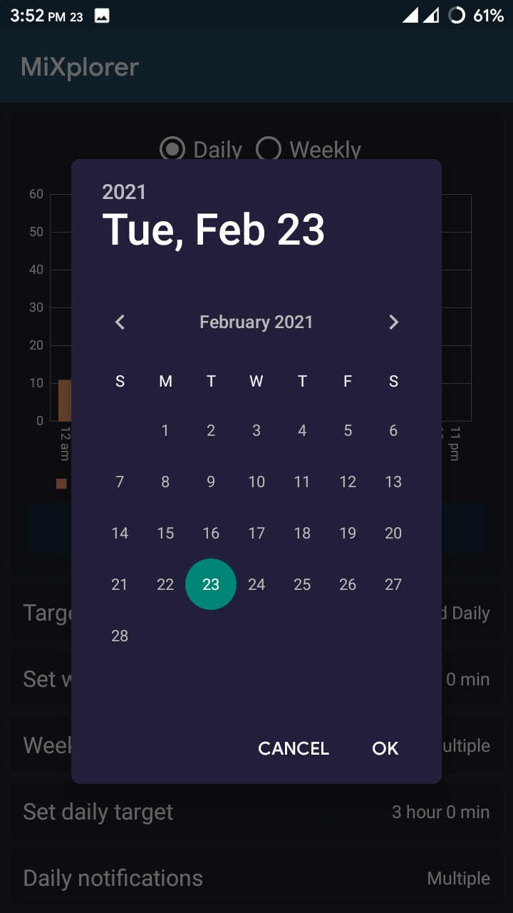

# App Usage Monitor

  

# Introduction
App usage tracker is built for collecting data for our thesis. App usage tracker is a simple app that tracks the usage of all your apps within your smartphone. You can see your daily or weekly usage history for any of your installed apps(up to the past 30 days). You can set daily or weekly targets and choose to get notifications at multiple levels of usage for any app. You can also see your past target history(how much of the target you used).

**App Link**: [https://drive.google.com/file/d/1ArCPhMQ9x4V-bBE1AZaaZXO9OOIQNRT3/view?usp=drive_link](https://drive.google.com/file/d/1ArCPhMQ9x4V-bBE1AZaaZXO9OOIQNRT3/view?usp=drive_link)

## Notifications
-  Upon exceeding the specified target for an app.
-  Upon exceeding 90% of the specified target for an app
-  Upon exceeding 80% of the specified target for an app
-  Upon exceeding 70% of the specified target for an app
-  Upon exceeding 60% of the specified target for an app
-  Upon exceeding 50% of the specified target for an app

## Note
The app is still in its early stage and we will update the app once we get any bug with the fix. So please give us your feedback, your feedback will be greatly appreciated.

# Screenshots

 
 
 
 

